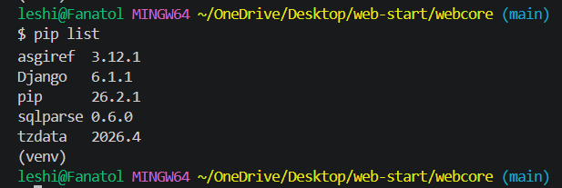
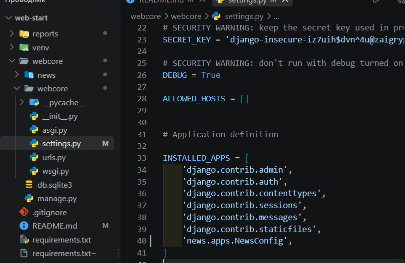
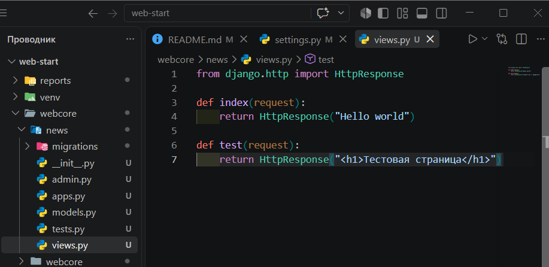
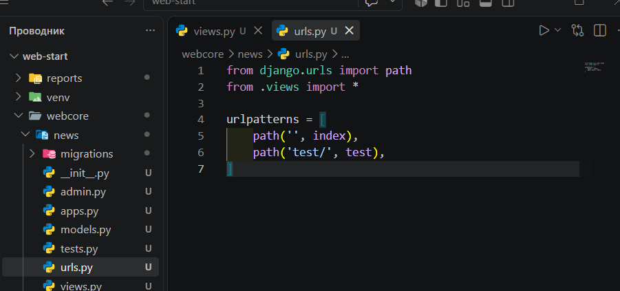
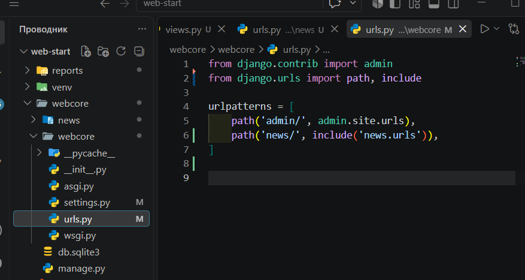
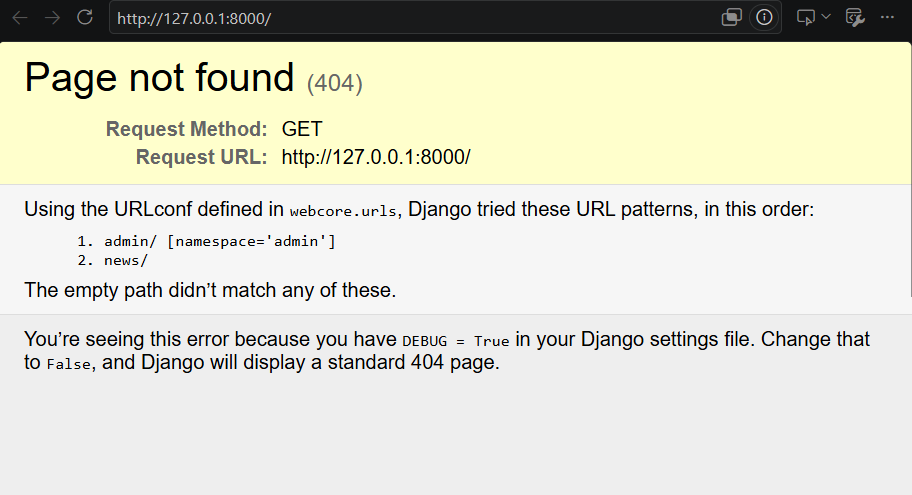
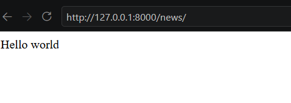
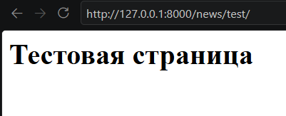

Лабораторная работа №1

Тема: Создание виртуального окружения. Контроллеры и маршруты

Студент: Лещинский П.А.
Группа: ПИЖ-б-о-25-2(2)

Версия: [ССЫЛКА]()

---

Цель работы

Настроить виртуальное пространство. Разработать контроллер приложения и организовать маршруты.

---

Ход работы

1. Проверка виртуального окружения и установленных пакетов

Выполнена команда pip list. В списке присутствует Django, что подтверждает корректную установку.

---

2. Регистрация приложения news

Создано приложение news командой python manage.py startapp news. Приложение зарегистрировано в INSTALLED_APPS в файле settings.py.

---

3. Написание контроллеров

В файле news/views.py написаны две функции: index и test, возвращающие HttpResponse.

---

4. Создание маршрутов приложения

Создан файл news/urls.py с urlpatterns, содержащий маршруты для index и test.

---

5. Подключение маршрутов в главный urls.py

В файле webcore/urls.py подключены маршруты приложения news через include.

---

6. Запуск сервера и проверка

Запущен сервер командой python manage.py runserver.

Страница /news/ отображает "Hello world".

Страница /news/test/ отображает "Тестовая страница".

---

Вывод

Создано виртуальное окружение, установлен Django, создан проект webcore и приложение news. Написаны контроллеры, настроены маршруты. Сервер работает, страницы открываются.
