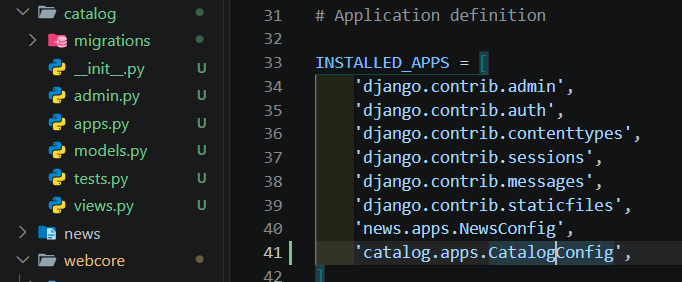
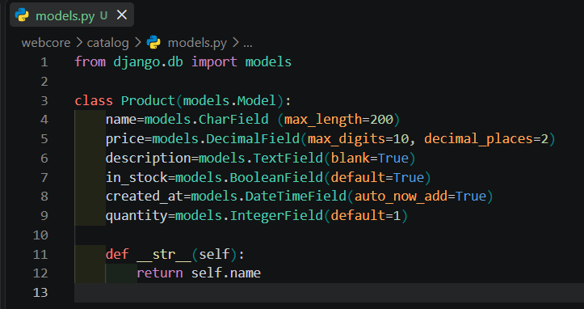
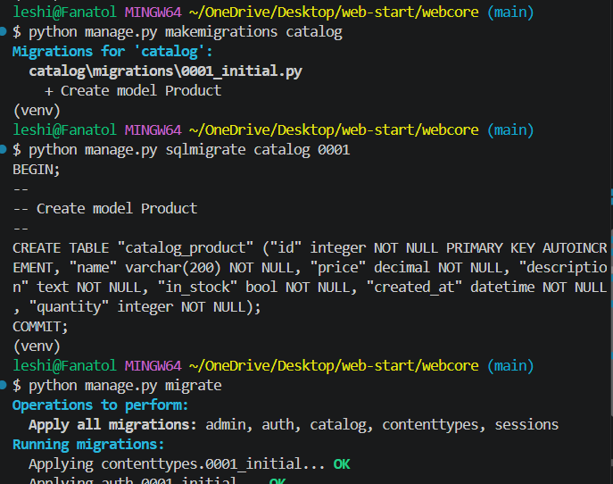
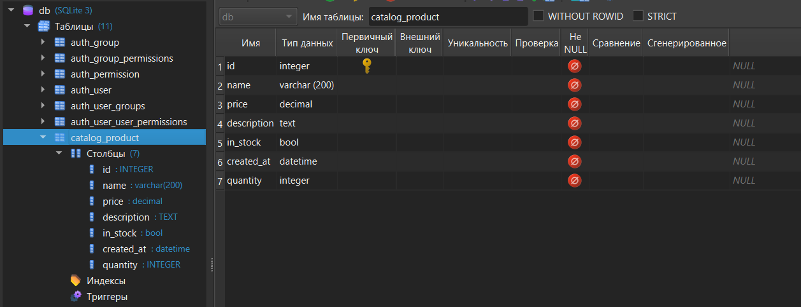
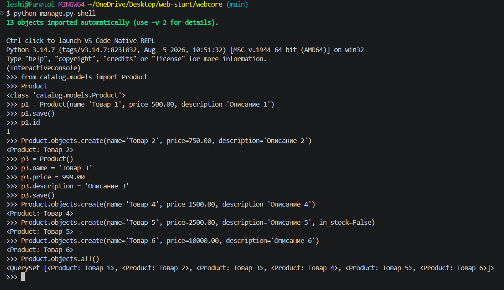
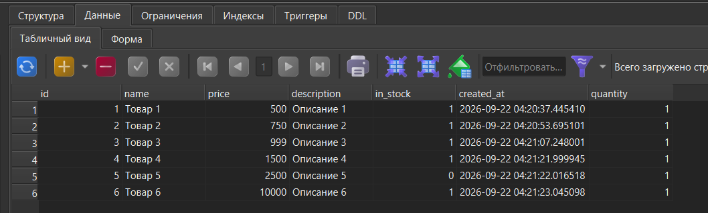
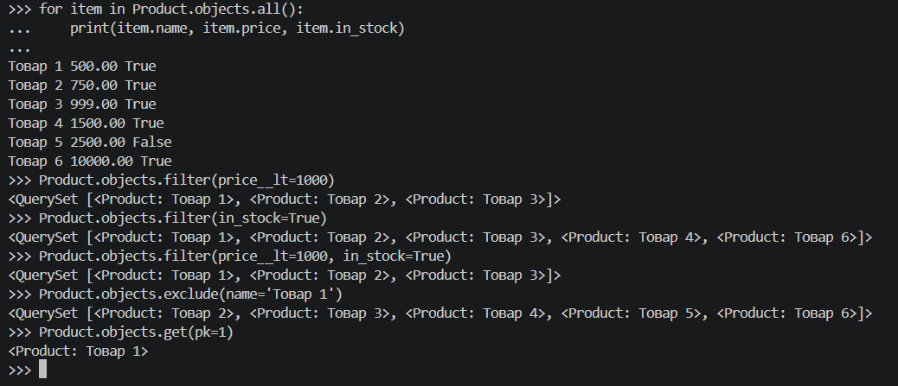
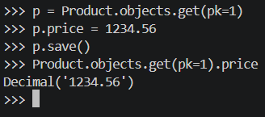
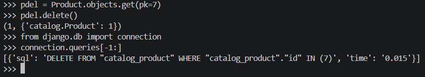
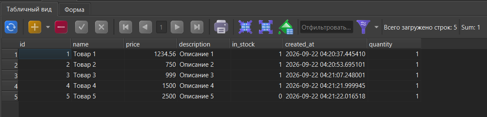

Лабораторная работа №2

Тема: Модели, миграции и ORM в Django

Студент: Лещинский П.А.
Группа: ПИЖ-б-о-25-2(2)

Версия: [<хеш>](https://github.com/Fanatol/web-start/commit/<хеш>)

---

Цель работы

Изучить модели Django, миграции и ORM. Научиться создавать модели, применять миграции, работать с CRUD-операциями через консоль Django.

---

Ход работы

1. Создание приложения catalog

Создано приложение catalog командой python manage.py startapp catalog. Приложение зарегистрировано в INSTALLED_APPS в файле settings.py как catalog.apps.CatalogConfig.

---

2. Создание модели Product

В файле catalog/models.py описана модель Product с полями name, price, description, in_stock, created_at, quantity. Добавлен метод __str__, возвращающий название товара.

---

3. Миграции

Выполнены команды makemigrations catalog, sqlmigrate catalog 0001 и migrate. Создан файл 0001_initial.py, применена миграция, в БД появилась таблица catalog_product.

---

4. Проверка таблицы в SQLiteStudio (Letos)

Таблица catalog_product открыта в Letos на вкладке «Структура». Видны все 7 полей: id, name, price, description, in_stock, created_at, quantity.

---

5. Создание записей через ORM

В консоли Django (python manage.py shell) импортирована модель Product. Созданы записи тремя способами: через конструктор + save(), через objects.create(), через конструктор без параметров с последующим заполнением атрибутов. Создано 6 товаров с разными ценами.

---

6. Проверка записей в БД

Таблица catalog_product содержит 6 записей. У Товара 5 значение in_stock = 0 (False), у остальных — 1 (True). Поле created_at заполнено автоматически, quantity = 1 по умолчанию.

---

7. Чтение и фильтрация

Выполнены: Product.objects.all(), цикл for с выводом name, price, in_stock. Продемонстрированы методы filter(), exclude(), get(). Главное задание варианта — вывод товаров дешевле 1000 руб. через filter(price__lt=1000) — вернул 3 товара (500, 750, 999).

---

8. Обновление записи (Update)

Получен Товар 1 через get(pk=1), цена изменена с 500.00 на 1234.56, вызван save(). Проверка get(pk=1).price вернула Decimal('1234.56').

---

9. Удаление записи (Delete) и просмотр SQL-запросов

Выполнено удаление товара через delete(). Результат — (1, {'catalog.Product': 1}). Импортирован connection из django.db, выведены SQL-запросы через connection.queries. Видно, что ORM преобразует Python-код в SQL.

---

10. Проверка БД после удаления

В таблице catalog_product осталось 5 записей. Товар 1 имеет обновлённую цену 1234.56, удалённая запись отсутствует.

---

Ответы на контрольные вопросы

1. Что такое модель в Django и для чего она используется?
Модель — класс, наследующийся от models.Model, описывающий структуру таблицы БД. Используется для хранения и извлечения данных через ORM без SQL.

2. Какие типы полей вы знаете? Приведите примеры.
CharField — строка (name), TextField — большой текст (description), DecimalField — точное дробное (price), BooleanField — True/False (in_stock), DateTimeField — дата/время (created_at), IntegerField — целое (quantity).

3. Чем отличаются параметры blank=True и null=True?
blank=True — поле может быть пустым в формах (валидация). null=True — поле может хранить NULL в БД.

4. Что такое миграции и зачем они нужны? Опишите основные команды.
Миграции — механизм отслеживания и применения изменений моделей к БД. Команды: makemigrations (создать файл миграции), migrate (применить к БД), sqlmigrate (показать SQL).

5. Как создать суперпользователя для доступа к административной панели Django?
Командой python manage.py createsuperuser. Задать имя, email, пароль. Вход — через /admin/.

6. Что такое ORM? Перечислите основные методы для выполнения операций CRUD.
ORM (Object-Relational Mapping) — работа с БД через Python-объекты без SQL. Create: save(), objects.create(). Read: all(), filter(), get(), exclude(). Update: изменение атрибута + save(). Delete: delete().

7. В чём разница между методами filter() и get()?
filter() возвращает QuerySet (0, 1 или много записей). get() — ровно один объект; при 0 — DoesNotExist, при >1 — MultipleObjectsReturned.

8. Как настроить загрузку изображений (медиафайлов) в проекте Django?
Задать MEDIA_ROOT и MEDIA_URL в settings.py, добавить маршрут через static() в urls.py при DEBUG=True. В моём варианте ImageField нет, поэтому настройка не производилась.

9. Для чего нужен метод __str__ в модели?
Определяет строковое представление объекта. Без него Django выводит <Product: Product object (1)>, с ним — <Product: Товар 1>. В моей модели возвращает self.name.

10. Что произойдёт, если выполнить python manage.py makemigrations, но не выполнить migrate?
Файл миграции создастся, но БД не изменится — таблица не появится, пока не выполнить migrate.

---

Вывод

Создано приложение catalog, описана модель Product с шестью полями и методом __str__. Выполнены миграции, в базе данных появилась таблица catalog_product. Освоены CRUD-операции через ORM: создание тремя способами, чтение, обновление, удаление. Продемонстрированы методы filter(), exclude(), get(), а также просмотр SQL-запросов через connection.queries. Задание варианта — вывод товаров дешевле 1000 руб. — выполнено через filter(price__lt=1000).