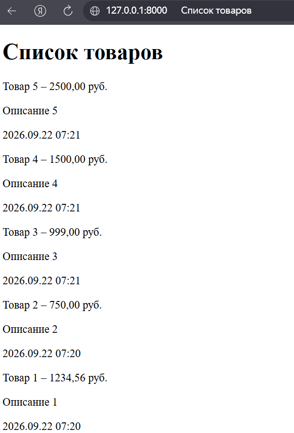
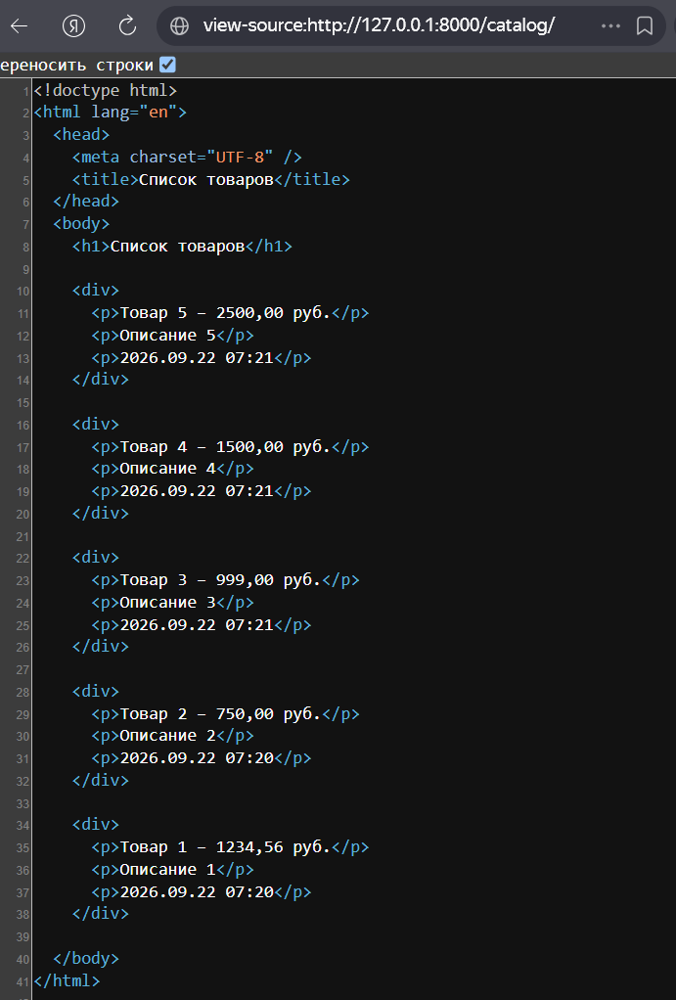
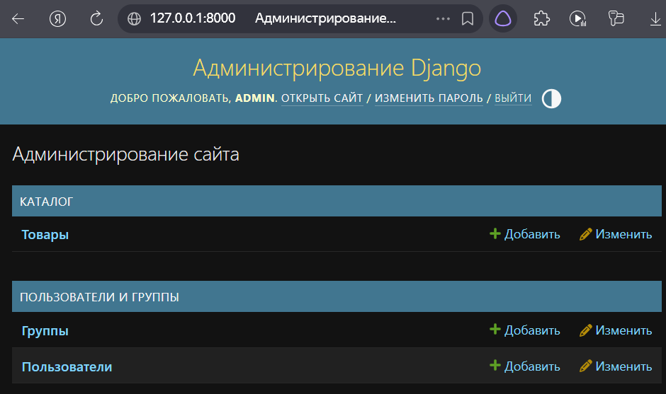
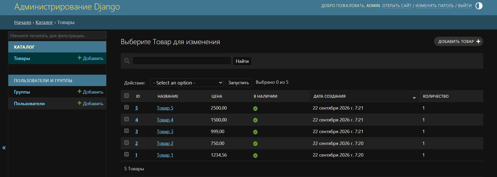
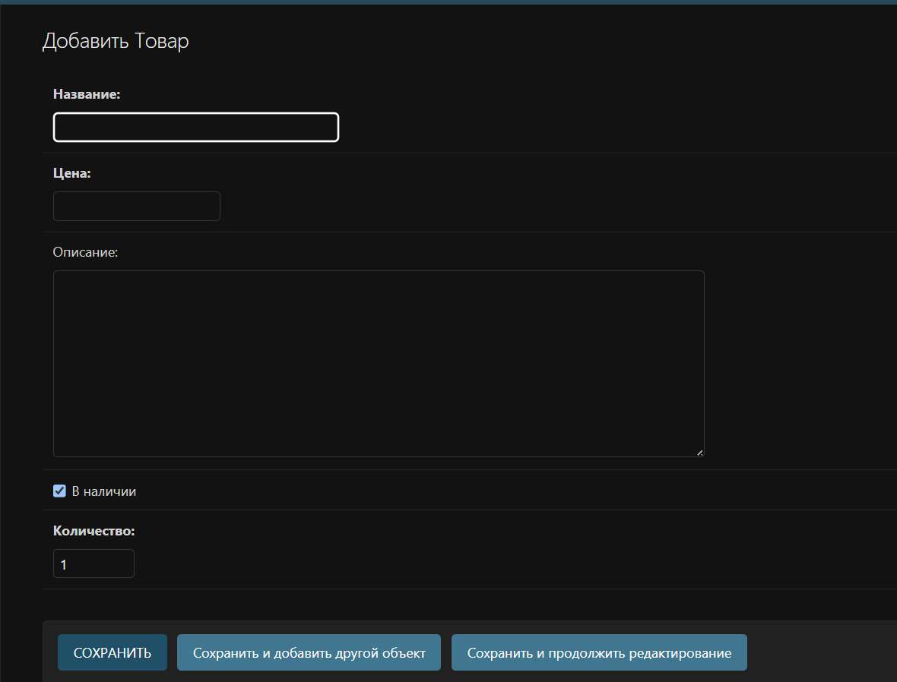
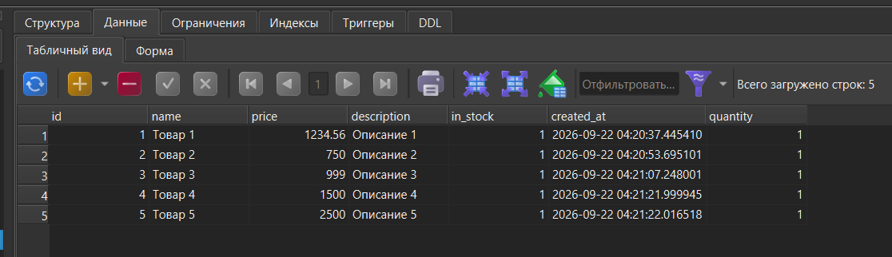

# Лабораторная работа №3: Шаблоны. Админка Django

**Студент:** Лещинский П.А.
**Группа:** ПИЖ-б-о-25-2(2)
**Вариант:** 2 (Каталог товаров)
**Технология:** Python 3.14 + Django 6.1 + SQLite

---

## Цель работы

Изучить механизм шаблонов Django, освоить рендеринг данных из моделей через `render()`. Научиться работать с шаблонизатором (директивы, теги, фильтры), настраивать локализацию и использовать встроенную админку Django для управления данными.

---

## Теоретическое обоснование

**Шаблоны Django** – HTML-файлы с плейсхолдерами, которые Django наполняет данными из моделей. 

**Рендеринг** – процесс наполнения шаблона данными и формирования итоговой HTML-страницы.

Шаблонизатор работает с тремя сущностями. **Директивы** (`{{ variable }}`) выводят значения из контекста. **Теги** (``) управляют логикой: циклы ``, условия ``. **Фильтры** (`{{ value|filter }}`) преобразуют значения перед выводом: `date` форматирует дату.

**Функция `render()`** принимает `request`, путь к шаблону и **контекст** – словарь с данными. Django ищет шаблоны в папке `templates` приложения.

**Админка Django** доступна по `/admin/`, требует суперпользователя. Модели регистрируются в `admin.py` через `admin.site.register()`. Класс **`ModelAdmin`** настраивает отображение: `list_display`, `list_display_links`, `search_fields`.

---

## Описание функционала

**Пользовательская страница `/catalog/`** – список всех товаров с названием, ценой, описанием и датой создания.

**Админка** – раздел «Каталог → Товары»: просмотр списка (колонки ID, Название, Цена, В наличии, Дата создания, Количество), поиск по названию и описанию, добавление, редактирование, удаление.

---

## Структура проекта

```
web-start/
├── README.md
├── reports/                    # отчёты и скриншоты
│   ├── lab1.md
│   ├── lab2.md
│   ├── lab3.md
│   └── screenshots/lab3/       # скриншоты к работе
└── webcore/                    # Django-проект
    ├── db.sqlite3
    ├── catalog/                # приложение «Каталог товаров»
    │   ├── templates/catalog/index.html
    │   ├── admin.py            # ProductAdmin
    │   ├── apps.py             # verbose_name приложения
    │   ├── models.py           # Product + Meta
    │   └── views.py            # index
    └── webcore/                # конфигурация проекта
        ├── settings.py         # настройка языка и времени
        └── urls.py
```

*Приведены только ключевые для данной работы файлы; остальные (стандартные файлы Django, миграции, служебные модули) опущены.*

---

## Скриншоты работы

<details>
<summary><b>lab3-1. Пользовательская страница /catalog/</b></summary>

**Запрос:** `GET http://127.0.0.1:8000/catalog/`

**Ожидаемый вывод:** заголовок «Список товаров» и карточки товаров с названием, ценой, описанием и датой. Данные получены из модели `Product` через ORM и переданы в шаблон через `render()`.



</details>

<details>
<summary><b>lab3-2. Исходный код страницы</b></summary>

**Запрос:** `Ctrl+U` на странице `/catalog/`

**Ожидаемый вывод:** полноценный HTML-документ с `<!doctype html>`, `<html>`, `<head>`, `<body>`. Данные из модели подставлены шаблонизатором Django.



</details>

<details>
<summary><b>lab3-3. Главная страница админки</b></summary>

**Запрос:** `GET http://127.0.0.1:8000/admin/`

**Ожидаемый вывод:** страница «Администрирование сайта» с разделом «КАТАЛОГ» (пункт «Товары») и стандартным «ПОЛЬЗОВАТЕЛИ И ГРУППЫ».



</details>

<details>
<summary><b>lab3-4. Список товаров в админке</b></summary>

**Запрос:** `GET http://127.0.0.1:8000/admin/catalog/product/`

**Ожидаемый вывод:** таблица с русскими колонками (ID, Название, Цена, В наличии, Дата создания, Количество), поле поиска сверху, ссылки на ID и Название для редактирования.



</details>

<details>
<summary><b>lab3-5. Форма добавления товара</b></summary>

**Запрос:** `GET http://127.0.0.1:8000/admin/catalog/product/add/`

**Ожидаемый вывод:** форма «Добавить Товар» с полями: Название, Цена, Описание, В наличии, Количество.



</details>

<details>
<summary><b>lab3-6. Таблица catalog_product в БД</b></summary>

**Запрос:** открытие `db.sqlite3` в SQLiteStudio (Letos)

**Ожидаемый вывод:** таблица `catalog_product` со всеми записями и полями `id`, `name`, `price`, `description`, `in_stock`, `created_at`, `quantity`.



</details>

---

## Вывод

Освоены шаблоны Django: создан `index.html` в структуре `templates/<app>/`, изучены директивы, теги и фильтры. Реализован рендеринг модели `Product` через `render()` с контекстом, настроены сортировка через `Meta.ordering` и локализация. Освоена админка: создан суперпользователь, модель зарегистрирована, настроен `ProductAdmin`. Поля и модель получили русские названия через `verbose_name`, класс `Meta` и `apps.py`.

---

## Список использованных источников

1. Документация Django – Templates. URL: https://docs.djangoproject.com/en/6.1/topics/templates/
2. Документация Django – The Django admin site. URL: https://docs.djangoproject.com/en/6.1/ref/contrib/admin/
3. Документация Django – Model Meta options. URL: https://docs.djangoproject.com/en/6.1/ref/models/options/
4. Django на русском. URL: https://django.fun/ru/