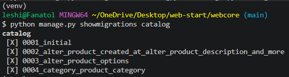
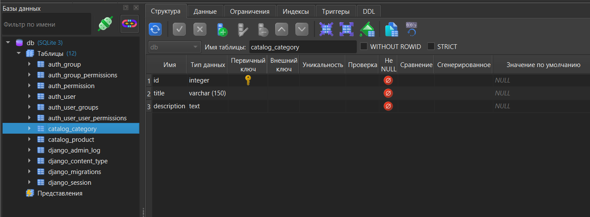
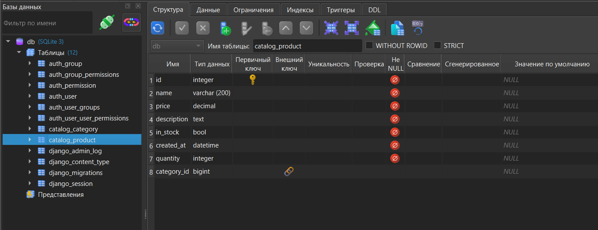
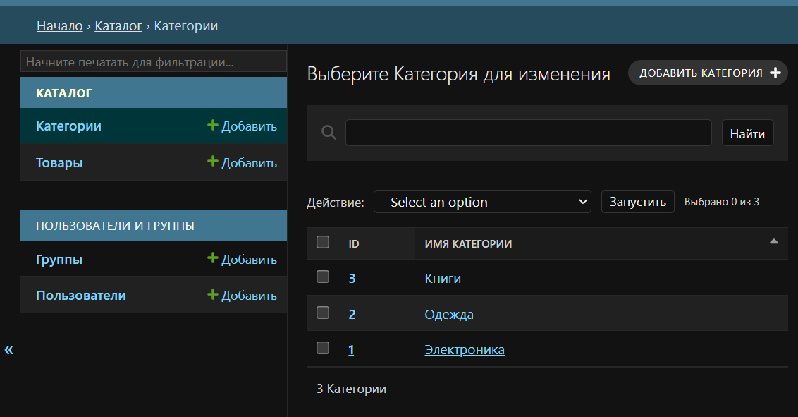
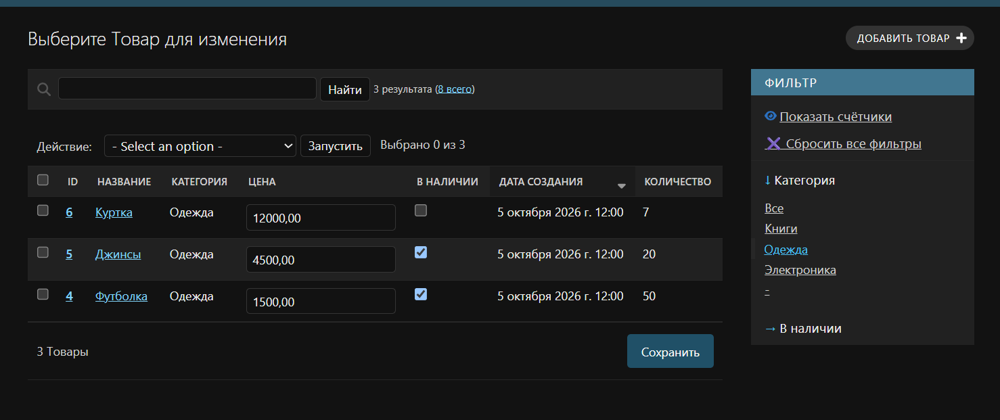
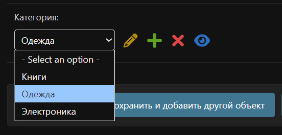
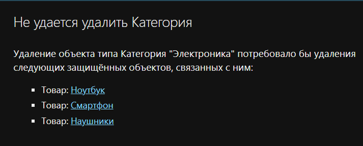

# Лабораторная работа №4: Связи моделей в Django

**Студент:** Лещинский П.А.
**Группа:** ПИЖ-б-о-25-2(2)
**Вариант:** 1 (Интернет-магазин: товары и категории)
**Технология:** Python 3.14 + Django 6.1 + SQLite

---

## Цель работы

Освоить создание и настройку связей между моделями Django (`ForeignKey`, `ManyToManyField`, `OneToOneField`), изучить параметры связей (`on_delete`, `related_name`, `null`, `blank`, `default`), научиться применять миграции при добавлении связей к существующим моделям и настраивать отображение связанных данных в административной панели.

---

## Теоретическое обоснование

**Связи между моделями** позволяют хранить данные в разных таблицах, не нарушая нормализации. Django предоставляет три типа связей.

**`ForeignKey`** (многие к одному) – одна запись первичной модели связана с многими записями вторичной. Пример: одна категория – много товаров. Объявляется во вторичной модели.

**`ManyToManyField`** (многие ко многим) – каждая запись одной модели связана с многими записями другой. Django создаёт промежуточную таблицу.

**`OneToOneField`** (один к одному) – одна запись связана ровно с одной. Пример: пользователь – профиль.

**`on_delete`** определяет поведение при удалении связанного объекта. Основные значения: `CASCADE`, `PROTECT`, `RESTRICT`, `SET_NULL`, `SET_DEFAULT`.

**`related_name`** задаёт имя обратного доступа от первичной модели к вторичной.

**`null=True`** разрешает NULL в БД, **`blank=True`** – пустое значение в формах. Для `ForeignKey` в существующей модели с данными `null=True` необходим для прохождения миграции.

---

## Описание моделей

| Модель | Роль | Поля |
|--------|------|------|
| `Category` | Первичная | `title`, `description` |
| `Product` | Вторичная | `name`, `price`, `description`, `in_stock`, `created_at`, `quantity`, `category` |

**Тип связи:** `ForeignKey` – одна категория, много товаров.

**Параметры связи:** `on_delete=PROTECT`, `related_name='products'`, `null=True`, `blank=True`.

**Выбор параметров:**

- `on_delete=PROTECT` – по заданию варианта 1: запрещает удаление категории, пока в ней есть товары.
- `null=True` – необходим, потому что в таблице `Product` уже были записи на момент добавления связи; без этого миграция упала бы с ошибкой целостности.
- `blank=True` – позволяет оставить поле пустым в формах админки.
- `related_name='products'` – даёт обратный доступ от категории к её товарам в удобочитаемом виде.
- `default` не использовался: указание `default=1` привело бы к ошибке, так как в таблице `Category` на момент миграции не было записи с `id=1`.

---

## Структура проекта

```
web-start/
├── README.md
├── reports/                    # отчёты и скриншоты
│   ├── lab1.md
│   ├── ...
│   ├── lab4.md
│   └── screenshots/lab4/       # скриншоты к работе
└── webcore/                    # Django-проект
    ├── db.sqlite3
    ├── catalog/                # приложение «Каталог товаров»
    │   ├── admin.py            # CategoryAdmin, ProductAdmin
    │   ├── models.py           # Category + Product + ForeignKey
    │   └── migrations/         # миграции
    └── webcore/
        └── ...
```

*Приведены только ключевые для данной работы файлы; остальные (стандартные файлы Django, служебные модули) опущены.*

---

## Скриншоты работы

<details>
<summary><b>lab4-1. Список миграций приложения catalog</b></summary>

**Запрос:** `python manage.py showmigrations catalog`

**Ожидаемый вывод:** четыре миграции с пометкой `[X]`, включая `0004_category_product_category` – создание `Category` и добавление внешнего ключа в `Product`.



</details>

<details>
<summary><b>lab4-2. Структура таблицы catalog_category</b></summary>

**Запрос:** открытие `catalog_category` в Letos → вкладка «Структура»

**Ожидаемый вывод:** поля `id` (PRIMARY KEY), `title`, `description`.



</details>

<details>
<summary><b>lab4-3. Структура таблицы catalog_product с внешним ключом</b></summary>

**Запрос:** открытие `catalog_product` в Letos → вкладка «Структура»

**Ожидаемый вывод:** поле `category_id` с пометкой FOREIGN KEY, ссылающееся на `catalog_category.id`.



</details>

<details>
<summary><b>lab4-4. Список категорий в админке</b></summary>

**Запрос:** `GET http://127.0.0.1:8000/admin/catalog/category/`

**Ожидаемый вывод:** три категории (Книги, Одежда, Электроника), отсортированные по алфавиту.



</details>

<details>
<summary><b>lab4-5. Список товаров с категориями и фильтрами</b></summary>

**Запрос:** `GET http://127.0.0.1:8000/admin/catalog/product/`

**Ожидаемый вывод:** таблица с колонкой «Категория», фильтрами справа (по категории и наличию), редактируемыми полями цены и наличия прямо в списке.



</details>

<details>
<summary><b>lab4-6. Форма редактирования товара</b></summary>

**Запрос:** `GET http://127.0.0.1:8000/admin/catalog/product/<id>/change/`

**Ожидаемый вывод:** форма с выпадающим списком «Категория», в котором отображаются названия категорий (Электроника, Одежда, Книги) вместо `Category object (1)`.



</details>

<details>
<summary><b>lab4-7. Проверка on_delete=PROTECT</b></summary>

**Запрос:** попытка удалить категорию с товарами через админку

**Ожидаемый вывод:** страница «Не удается удалить Категория» с перечнем защищённых объектов – товаров, привязанных к этой категории.



</details>

---

## Вывод

В ходе работы создана модель `Category`, а в существующую модель `Product` добавлено поле `ForeignKey`. В админ-панели зарегистрированы обе модели, проведены миграции и настроено удобное отображение в админ-панели.

**Трудности и решения:** при добавлении обязательного `ForeignKey` в модель с существующими записями потребовалось бы указывать значение для каждой строки – решением стал параметр `null=True`. Параметр `default=1` сознательно не использовался, так как на момент миграции в таблице `Category` не было записи с `id=1`, что привело бы к ошибке целостности данных. Проверка `on_delete=PROTECT` подтвердила корректность: категория с товарами удалиться не может, а пустая категория удаляется без ошибок.

---

## Список использованных источников

1. Документация Django – Model field reference (Relationships). URL: https://docs.djangoproject.com/en/6.1/ref/models/fields/#module-django.db.models.fields.related
2. Документация Django – The Django admin site. URL: https://docs.djangoproject.com/en/6.1/ref/contrib/admin/
3. Документация Django – Model Meta options. URL: https://docs.djangoproject.com/en/6.1/ref/models/options/
4. Django на русском. URL: https://django.fun/ru/