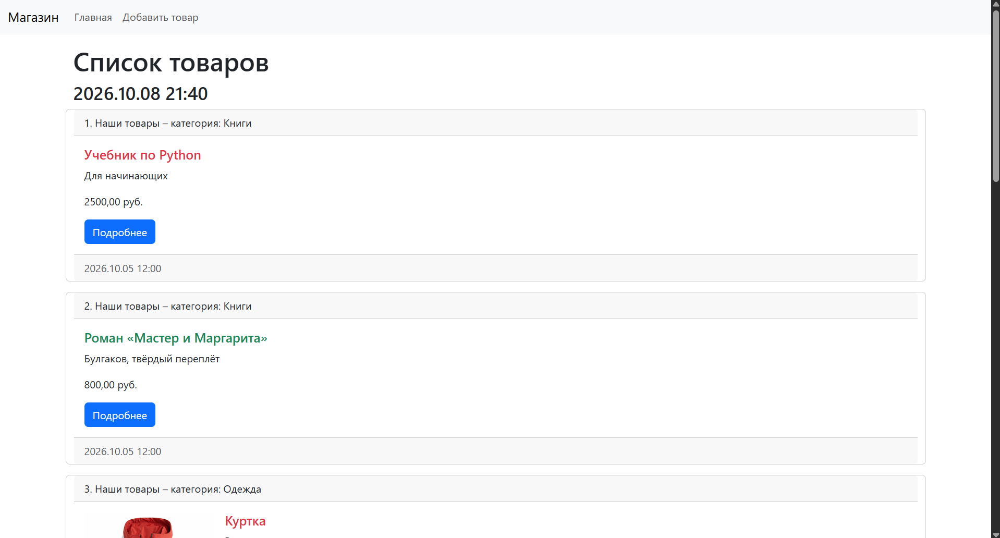
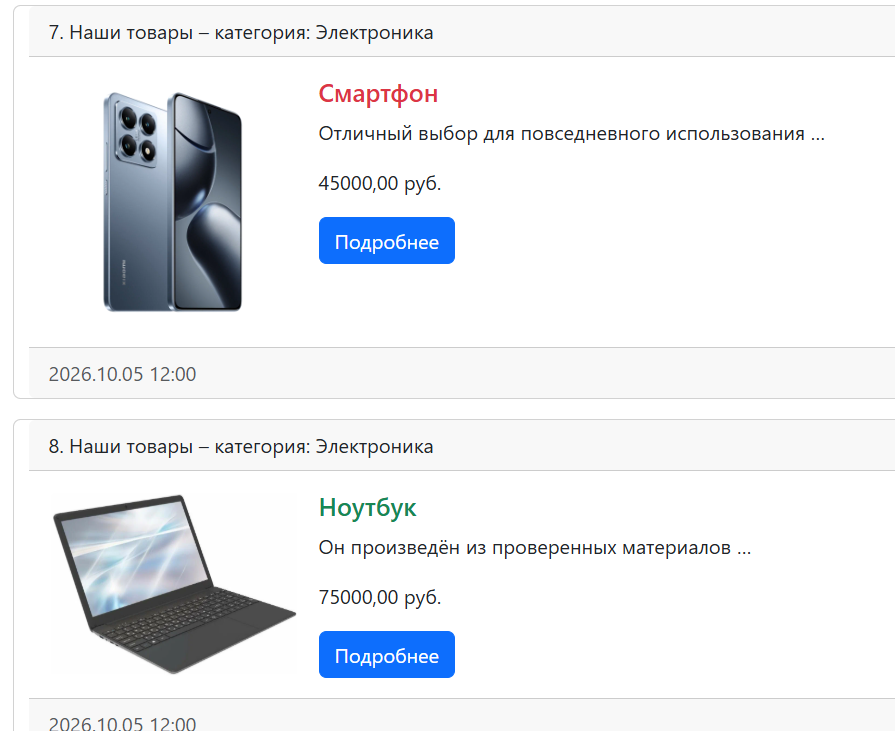
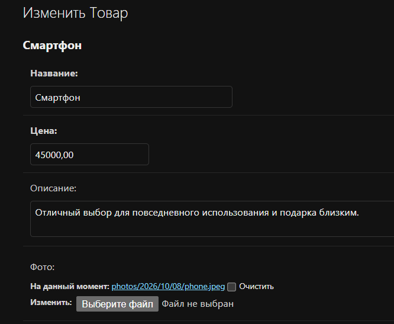
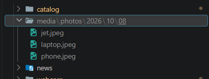
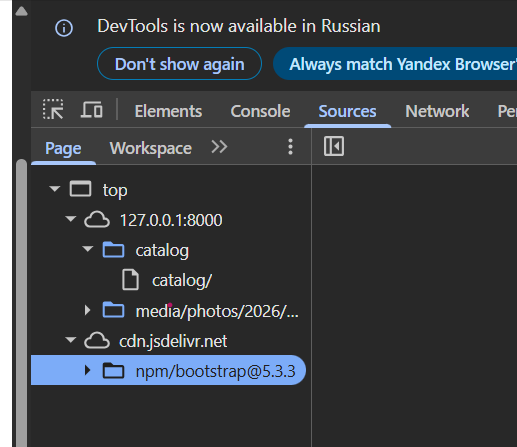

# Лабораторная работа №5: Bootstrap и шаблоны Django

**Студент:** Лещинский П.А.

**Группа:** ПИЖ-б-о-25-2(2)

**Вариант:** 1 (Интернет-магазин: товары и категории)

**Технология:** Python 3.14 + Django 6.1 + SQLite + Bootstrap 5.3

---

## Цель работы

Освоить подключение CSS-фреймворка Bootstrap через CDN и применение его компонентов для оформления страниц Django. Изучить теги и фильтры шаблонизатора (``, ``, `truncatewords`), научиться выводить медиафайлы (`ImageField`) и вызывать методы моделей прямо из шаблона.

---

## Теоретическое обоснование

**Bootstrap** – CSS-фреймворк с готовыми классами и компонентами (navbar, card, button, grid). Подключается через **CDN (Content Delivery Network)** – распределённую сеть серверов, отдающих статические файлы с ближайшей к пользователю точки. Это позволяет не хранить CSS-файл в проекте.

**Основные компоненты Bootstrap 5:**

- **Navbar** – навигационная панель (`.navbar`, `.navbar-brand`, `.nav-link`).
- **Card** – карточка с шапкой (`.card-header`), телом (`.card-body`), футером (`.card-footer`), заголовком (`.card-title`) и текстом (`.card-text`).
- **Container** – обёртка с центрированием (`.container`).
- **Row** – строка сетки (`.row`).
- **Flexbox** – для размещения элементов в ряд используется `.d-flex`, для растягивания блока – `.flex-grow-1`, для отступов – `.me-3` (margin-end), `.mb-3` (margin-bottom), `.mt-3` (margin-top).

**Теги шаблонизатора Django:**

- **``** – выводит текущую дату/время в заданном формате.
- **``** – поочерёдно выводит значения из списка при каждой итерации.
- **`{{ forloop.counter }}`** – номер текущей итерации цикла (с 1).

**Фильтры:**

- **`truncatewords:N`** – обрезает текст до N слов с многоточием.
- **`safe`** – не экранирует HTML-теги.
- **`linebreaks`** – превращает переводы строк в `<br>`.

**Медиафайлы:**

- **`ImageField(upload_to='...')`** – поле для загрузки изображений (требует Pillow).
- **`MEDIA_ROOT`** – путь к папке для хранения файлов.
- **`MEDIA_URL`** – URL-префикс для доступа к файлам.
- Маршрут в `urls.py` через `static()` при `DEBUG=True`.

**Вызов методов в шаблоне:** Django-шаблон может обращаться не только к атрибутам, но и к методам модели без аргументов: `{{ item.my_func }}` вызовет метод `my_func()`.

---

## Описание функционала

**Страница `/catalog/`** оформлена с использованием Bootstrap:

- Navbar с брендом «Магазин» и ссылками «Главная», «Добавить товар».
- Список товаров в виде карточек. В каждой: номер, название метода `my_func`, категория, фото (если загружено), название, описание (обрезанное до 5 слов), цена, кнопка «Подробнее», дата создания.
- Чередование цвета названий товаров (красный/зелёный) через ``.
- Текущая дата/время в шапке страницы через ``.

**Медиафайлы:** загрузка фото через админку, хранение в `media/photos/%Y/%m/%d/`, вывод на странице через `{{ item.photo.url }}`.

---

## Структура проекта

```
web-start/
├── README.md
├── reports/                    # отчёты и скриншоты
│   ├── lab1.md
│   ├── ...
│   ├── lab5.md
│   └── screenshots/lab5/       # скриншоты к работе
└── webcore/                    # Django-проект
    ├── db.sqlite3
    ├── media/                  # загруженные медиафайлы
    │   └── photos/2026/10/08/
    ├── catalog/                # приложение «Каталог товаров»
    │   ├── templates/catalog/index.html
    │   ├── models.py
    │   └── ...
    └── webcore/
        ├── settings.py         # MEDIA_ROOT, MEDIA_URL
        └── urls.py             # маршрут для медиа
```

_Приведены только ключевые для данной работы файлы; остальные (стандартные файлы Django, служебные модули) опущены._

---

## Скриншоты работы

<details>
<summary><b>lab5-1. Страница /catalog/ целиком</b></summary>

**Запрос:** `GET http://127.0.0.1:8000/catalog/`

**Ожидаемый вывод:** Navbar с брендом и ссылками, заголовок «Список товаров», текущая дата/время, карточки товаров с фото, названиями (чередующийся цвет), описаниями, ценами и кнопками.



</details>

<details>
<summary><b>lab5-2. Одна карточка крупным планом</b></summary>

Фото товара слева, текст справа – заголовок с чередующимся цветом, описание (обрезанное до 5 слов с многоточием), цена, кнопка «Подробнее». В шапке – номер, метод `my_func`, категория. В футере – дата.



</details>

<details>
<summary><b>lab5-3. Админка – форма товара с загруженным фото</b></summary>

**Запрос:** `GET http://127.0.0.1:8000/admin/catalog/product/<id>/change/`

**Ожидаемый вывод:** форма редактирования товара, поле «Фото» показывает ссылку на загруженный файл (например, `photos/2026/10/08/jet.jpeg`) и кнопку «Очистить».



</details>

<details>
<summary><b>lab5-4. Папка media с загруженным файлом</b></summary>

Загруженный файл `jet.jpeg` (или другое имя) с превью изображения. Путь соответствует `upload_to='photos/%Y/%m/%d/'`.



</details>

<details>
<summary><b>lab5-5. DevTools – источники ресурсов страницы</b></summary>

**Запрос:** F12 → вкладка Sources в браузере

**Ожидаемый вывод:** дерево ресурсов: страница – с `127.0.0.1:8000`, Bootstrap CSS – с `cdn.jsdelivr.net`, медиафайлы – с `127.0.0.1:8000/media/`. Подтверждает, что Bootstrap подключён через CDN, а медиафайлы отдаются Django в режиме отладки.



</details>

---

## Вывод

В ходе работы подключён Bootstrap 5.3 через CDN, страница `/catalog/` переоформлена: добавлен navbar, карточки товаров с фото, кнопками и футером, контейнер и сетка. Освоены теги шаблонизатора. Реализован вывод медиафайлов. Проверена загрузка фото через админку и его вывод в карточке товара. Освоен вызов методов модели из шаблона.

**Трудности и решения:** при добавлении `ImageField` потребовалась установка Pillow – без неё миграция падала с ошибкой. При настройке `MEDIA_ROOT` использован современный синтаксис `BASE_DIR / "media"` вместо `os.path.join`, чтобы не добавлять лишний импорт `os`.

---

## Список использованных источников

1. Bootstrap 5.3 Documentation – Components. URL: https://getbootstrap.com/docs/5.3/components/
2. Bootstrap 5.3 – Starter template. URL: https://getbootstrap.com/docs/5.3/getting-started/introduction/
3. Документация Django – Managing files (MEDIA_ROOT, MEDIA_URL). URL: https://docs.djangoproject.com/en/6.1/topics/files/
4. Документация Django – Built-in template tags and filters. URL: https://docs.djangoproject.com/en/6.1/ref/templates/builtins/
5. Django на русском. URL: https://django.fun/ru/
